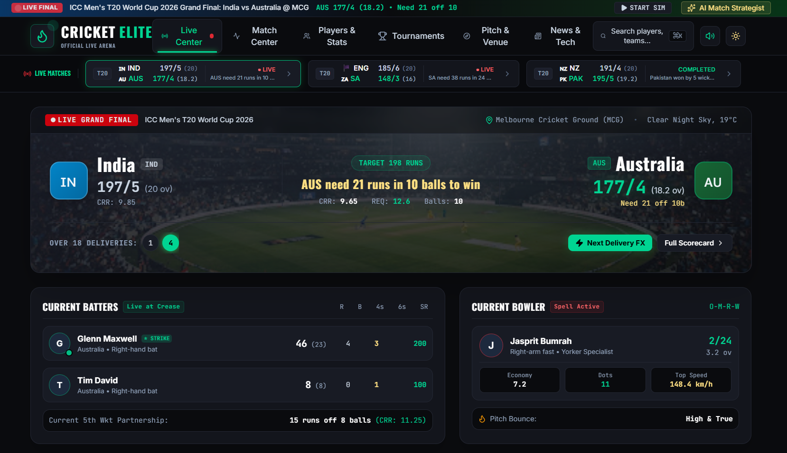
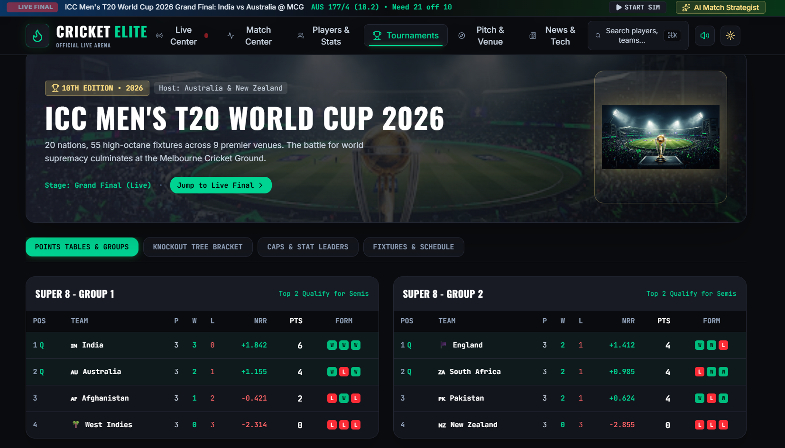
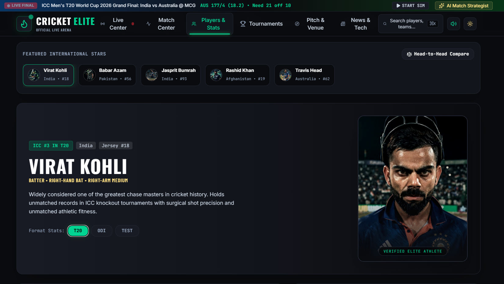
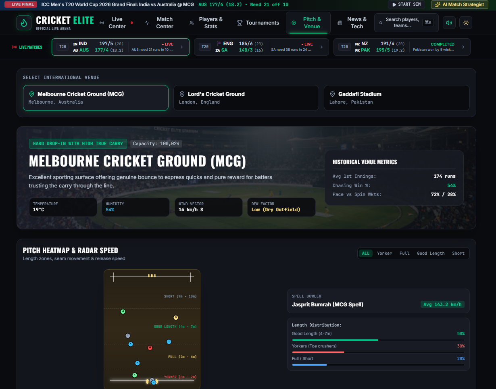
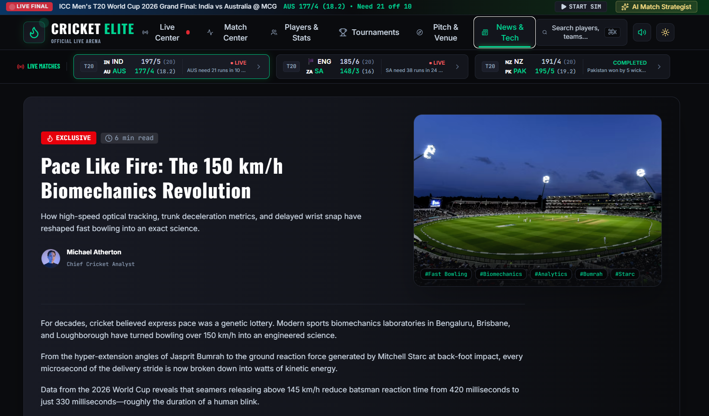

<div align="center">

# 🏏 Cricket Elite

### **Where Cricket Meets Interactive Intelligence**

**A Premium Interactive Cricket Analytics & Live Match Experience**

Cricket Elite is a visually immersive cricket platform that blends a live-match interface, player analytics, tournament intelligence, pitch &amp; venue analysis, and cricket editorial content into one cohesive, stadium-inspired product experience.

<br/>

[](https://cricket-elite.vercel.app/)
[](https://cric-ai.ai.studio)

<br/>


[](LICENSE)

</div>

<br/>

> **Note on data:** Cricket Elite V1 runs on **simulated/demo cricket data** to demonstrate product behavior. It is not connected to a live/official cricket data feed. See [Data & Simulation](#-data--simulation) for details.

---

## 📍 Quick Links

<p align="center">
<a href="#-live-demo">🚀 Live Demo</a> •
<a href="#-screenshot-showcase">📸 Screenshots</a> •
<a href="#-core-features">⚡ Features</a> •
<a href="#-ai-assisted-build-journey">🧠 AI & Development</a> •
<a href="#-technology-stack">🛠️ Tech Stack</a> •
<a href="#-project-architecture">📁 Project Structure</a> •
<a href="#-getting-started">🚀 Getting Started</a> •
<a href="#-roadmap">🗺️ Roadmap</a> •
<a href="#-author">👨‍💻 Author</a>
</p>

---

## 🚀 Live Demo

<div align="center">

| Deployment | Link | Notes |
|---|---|---|
| **Vercel** | **[cricket-elite.vercel.app](https://cricket-elite.vercel.app/)** | Primary production build |
| **Google AI Studio** | **[cric-ai.ai.studio](https://cric-ai.ai.studio)** | Built &amp; published via Google AI Studio |

</div>

---

## 📸 Screenshot Showcase

<div align="center">

### ⚡ Live Match Center
*Live-score presentation, current batters &amp; bowler, partnership tracking, and the interactive ball-by-ball match simulation.*



<br/><br/>

### 🏆 Tournament Hub
*ICC-style tournament overview, Super 8 groups, points tables, form guides and competition structure.*



<br/><br/>

### 👤 Players &amp; Statistics
*Player profiles, ICC rankings, format-wise stats (T20 / ODI / Test) and head-to-head comparison.*



<br/><br/>

### 🏟️ Pitch &amp; Venue
*Venue selection, historical venue metrics, weather conditions and a pitch heatmap with length-zone &amp; release-speed distribution.*



<br/><br/>

### 📰 News &amp; Tech
*Editorial cricket journalism and technology-focused long-form stories with tagging and author bylines.*



</div>

---

## 🧭 What Is Cricket Elite?

Cricket Elite isn't just another cricket scoreboard. It's an attempt to design a **visual cricket experience** — one that borrows the energy of a stadium broadcast graphics package and the density of a professional analytics terminal, then wraps both in a clean, component-driven front end.

The product was designed around a simple question: *what would a cricket platform look like if it were designed like a premium product first, and a data table second?*

That shows up in a few deliberate choices:

- **Immersive, cricket-first design** — dark, stadium-inspired surfaces with a sharp emerald accent system
- **A live match experience** — not a static scorecard, but an interface built around a running match state
- **Data visualization** — wagon wheels, pitch maps, win-probability meters and worm charts instead of plain numbers
- **Player analytics** — profile-driven stats rather than flat tables
- **Tournament intelligence** — groups, points tables and knockout structure presented like a broadcast graphic
- **Venue intelligence** — pitch and conditions data tied to the match context
- **Editorial content** — a dedicated news/technology hub, not just scores
- **Interactive components** — search, theming, sound design and a match simulator
- **Responsive layout** — built with Tailwind CSS across breakpoints
- **Dark / light theme system** — a toggleable, stadium-inspired dark mode and a light mode

---

## ⚡ Core Features

### 🔴 Live Match Center
- Real-time-styled score presentation for the featured match
- Match status banner (e.g. `LIVE FINAL`), venue and conditions
- Current batters at the crease with runs, balls, 4s, 6s and strike rate
- Current bowler with spell figures, economy, dot-ball count and top speed
- Live required run-rate, target and balls-remaining tracking
- Current partnership tracking (runs / balls / run-rate)
- A secondary live-matches ticker showing other concurrent fixtures

### 🎯 Interactive Match Simulation
A `START SIM` control drives a **ball-by-ball simulation engine** built into the app: each triggered delivery updates the score, balls remaining, runs needed, partnership and commentary state in real time, complete with sound effects (via the Web Audio API) and a confetti celebration when the simulated chase is completed. This demonstrates how a future real-time platform could feel, without depending on an external live-data provider.

### 👤 Player Profiles
- Player identity, role, batting/bowling style and jersey number
- ICC ranking badges per format
- Format-specific statistics across **T20 / ODI / Test**
- Radar-style performance metrics (boundary %, strike rotation, pace/spin handling, clutch factor, consistency)
- Recent form history
- Head-to-head player comparison

### 🏆 Tournament Hub
- Tournament overview banner with host, edition and stage
- Super 8-style groups with points tables, net run rate and form guide
- Knockout tree / bracket view
- Fixtures &amp; schedule
- Caps &amp; statistical leaders

### 🏟️ Pitch &amp; Venue Intelligence
- International venue selector
- Venue capacity, surface type and description
- Historical venue metrics (average first-innings score, chasing win %, pace vs. spin wicket split)
- Live conditions: temperature, humidity, wind vector, dew factor
- **Pitch heatmap** plotting delivery line/length zones
- Bowling length distribution (yorker / full / good length / short) and radar speed per spell

### 📊 Cricket Analytics
- Win-probability meter comparing both teams
- Manhattan/worm-style innings progression chart
- Wagon wheel shot mapping by angle, distance and runs
- Visual, chart-driven presentation instead of raw stat tables

### 📰 News &amp; Technology
- Editorial hero stories (e.g. cricket biomechanics and pace-bowling analytics features)
- Author bylines, read-time and topic tags
- Featured/exclusive story flagging and a reader poll component

### 🧠 AI Match Strategist *(Interactive Demo Mode)*
A tactics-engine modal offering pre-built tactical scenarios (bowling plans, field placements, risk factor) plus a custom-question input. See [AI Match Strategist](#-ai-match-strategist) below for exactly what this does and does not do today.

### 🔎 Search
A command-palette-style search modal (⌘K / Ctrl+K) for jumping directly to players, matches, teams and sections of the app.

### 🌗 Theme System
- Stadium-inspired **dark mode** (default)
- **Light mode** toggle
- Theme state managed at the application level

### 📱 Responsive Experience
Built with Tailwind CSS utility classes and responsive grid/flex layouts so the interface adapts across desktop, tablet and mobile viewports.

---

## 🎨 Design Philosophy

> **"Designed to feel like cricket, not just display cricket data."**

Cricket Elite deliberately avoids the "spreadsheet with a scoreboard on top" look common to many cricket sites. Instead, the interface borrows from stadium broadcast graphics and modern sports-analytics dashboards:

- **Stadium-inspired dark surfaces** — near-black backgrounds (`#0A0B0E`) that let scores, colors and charts pop
- **A disciplined emerald/green accent system** — used consistently for "live," "positive" and primary-action states
- **Strong, condensed typography** — Barlow Condensed and Oswald for headlines, Inter for body text, JetBrains Mono for stats and telemetry-style data
- **Score-first visual hierarchy** — the live match state is always the most prominent element on screen
- **Editorial layouts** — the News &amp; Tech hub reads like a sports magazine, not a blog list
- **Real data visualization** — wagon wheels, pitch maps and worm charts instead of plain tables
- **Cricket-specific iconography** — via `lucide-react`, chosen and composed for a cricket-broadcast feel
- **Micro-interactions** — hover states, live pulse indicators, animated transitions
- **Layered cards** — bordered, elevated surfaces that separate dense information without feeling cluttered
- **Visual storytelling** — every screen is built to communicate match context at a glance, not just numbers

---

## 🧠 AI-Assisted Build Journey

Cricket Elite was built as part of my hands-on learning experience during the **Build with AI Bootcamp**, brought by **Google for Developers** and **Hack2skill**. The bootcamp introduced practical, AI-assisted development workflows using Google's AI development tooling, and Cricket Elite is the applied outcome of that learning.

The build followed this workflow:

| Step | Description |
|---|---|
| **1. Learn** | Understanding Generative AI fundamentals, prompt engineering and AI-assisted development practices |
| **2. Design** | Using **Google Stitch** to explore visual direction and generate initial screen designs |
| **3. Prompt** | Writing structured prompts to communicate the desired product, UI and interaction requirements |
| **4. Build** | Using **Google AI Studio** to generate and iteratively build out the application |
| **5. Refine** | Reviewing screens, interactions, responsive behavior and visual consistency, and refining with **Google Antigravity** and manual iteration |
| **6. Deploy** | Publishing the application to **Vercel** and **Google AI Studio** |

This project is presented as an example of an **AI-assisted development workflow** — Generative AI accelerated design exploration, prototyping and iteration, but the product decisions, structuring and refinement were driven hands-on throughout the build.

---

## 🛠️ Technology Stack

Verified directly from `package.json` and the source tree — nothing listed here is assumed.

<div align="center">


</div>

| Category | Technology |
|---|---|
| **UI Library** | React 19 |
| **Language** | TypeScript 5.8 |
| **Build Tool** | Vite 6 |
| **Styling** | Tailwind CSS 4 (via `@tailwindcss/vite`), `autoprefixer` |
| **Icons** | `lucide-react` |
| **Animation** | `motion` (Framer Motion) |
| **Effects** | `canvas-confetti` (chase-completion celebration) |
| **AI Tooling (dependency, not yet wired up)** | `@google/genai` — present in `package.json`; see [AI Match Strategist](#-ai-match-strategist) |
| **Server (available, not required for the SPA build)** | `express`, `dotenv` |
| **Deployment** | Vercel, Google AI Studio |
| **Type-checking / Linting** | `tsc --noEmit` |

> `@google/genai` is included as a dependency but is **not currently called anywhere in the source code** — the AI Match Strategist runs entirely on local, pre-written scenario data. This is intentionally documented in [AI Match Strategist](#-ai-match-strategist) below.

---

## 📁 Project Architecture

```
cricket-elite/
├── docs/
│   └── screenshots/            # Product screenshots used in this README
│       ├── live_center.png
│       ├── tournaments.png
│       ├── players_stats.png
│       ├── pitch_and_venue.png
│       └── news_and_tech.png
├── src/
│   ├── components/             # Reusable UI building blocks
│   │   ├── AIStrategistModal.tsx
│   │   ├── LiveScoreTicker.tsx
│   │   ├── ManhattanWormChart.tsx
│   │   ├── Navbar.tsx
│   │   ├── PitchMap.tsx
│   │   ├── SearchModal.tsx
│   │   ├── WagonWheel.tsx
│   │   └── WinPredictorMeter.tsx
│   ├── views/                  # Top-level screens/pages
│   │   ├── LiveCenterView.tsx
│   │   ├── MatchCenterView.tsx
│   │   ├── NewsHubView.tsx
│   │   ├── PlayerProfileView.tsx
│   │   ├── StadiumPitchView.tsx
│   │   └── TournamentHubView.tsx
│   ├── data/
│   │   └── cricketData.ts      # Demo/simulated match, player, tournament & news data
│   ├── types.ts                # Shared TypeScript types (Match, Player, Team, etc.)
│   ├── App.tsx                 # App shell, tab routing, simulation engine, sound effects
│   ├── main.tsx                # React entry point
│   └── index.css               # Global styles / Tailwind entry
├── index.html                  # Vite HTML entry
├── vite.config.ts              # Vite + Tailwind + path alias configuration
├── tsconfig.json
├── package.json
├── metadata.json                # App metadata (AI Studio)
└── LICENSE
```

---

## 🖥️ Component / Screen Overview

| Screen | Purpose | Key Experience |
|---|---|---|
| **Live Center** (`LiveCenterView`) | The primary live-match screen | Live score, current batters/bowler, partnership, win probability, ball-by-ball simulation |
| **Match Center** (`MatchCenterView`) | Detailed match breakdown | Full scorecard context, worm chart, wagon wheel, pitch map for the selected match |
| **Players &amp; Stats** (`PlayerProfileView`) | Player-focused analytics | Featured stars, format stats, radar metrics, head-to-head compare |
| **Tournaments** (`TournamentHubView`) | Tournament-level view | Points tables, groups, knockout bracket, fixtures, stat leaders |
| **Pitch &amp; Venue** (`StadiumPitchView`) | Venue &amp; conditions intelligence | Venue selector, historical metrics, live conditions, pitch heatmap |
| **News &amp; Tech** (`NewsHubView`) | Editorial content hub | Featured articles, tags, author bylines, reader poll |
| **AI Match Strategist** (`AIStrategistModal`) | Tactical scenario explorer | Preset tactical scenarios, field placements, custom query input |
| **Search** (`SearchModal`) | Global search | ⌘K-triggered search across players, matches and teams |

---

## 🗄️ Data &amp; Simulation

> **Cricket Elite V1 uses simulated/demo cricket data for demonstration purposes.**

All matches, players, tournaments, venues and news content in this build are sourced from a local, hand-authored dataset (`src/data/cricketData.ts`) — there is **no connection to an official or real-time cricket data feed**.

The "live" experience in the Live Match Center is powered by a **client-side ball-by-ball simulation engine** in `App.tsx`. Triggering `START SIM` steps the featured match forward — updating score, overs, required run rate, partnership and commentary state — to demonstrate how a real-time platform *could* behave, complete with sound effects and celebratory confetti on a completed chase.

This architecture (typed data models in `types.ts`, a centralized data layer, and view components that simply render match/player/tournament state) is intentionally structured so that the demo dataset could later be swapped for a real cricket data API without redesigning the UI layer.

---

## 🧠 AI Match Strategist

The navbar includes an **AI Match Strategist** entry point that opens a tactics-engine modal.

**Current V1 — Interactive Demo Mode**
- Presents a set of pre-written tactical scenarios (e.g. death-over bowling plans, countering a specific batter, reading a bowler's variations), each with a recommendation, a "probability of success" figure, key action points and suggested field placements
- Includes a free-text "custom tactical inquiry" box — submitting a question returns a single pre-written demo response rather than a live, context-aware answer
- All content is hard-coded in the component (`AIStrategistModal.tsx`); there is **no call to the Gemini API or any AI model** in the current build, even though `@google/genai` is listed as a project dependency

**Future AI capabilities (planned, not yet built)**
- Genuine Gemini-powered tactical analysis grounded in live match state
- Match-situation-aware bowling and batting recommendations
- Context-aware, natural-language cricket insights
- Dynamic responses to arbitrary user questions rather than a fixed scenario set

---

## 🏁 Getting Started

**Prerequisites:** [Node.js](https://nodejs.org/) (LTS recommended)

```bash
# 1. Clone the repository
git clone https://github.com/dk-khandelwal06/cricket-elite.git
cd cricket-elite

# 2. Install dependencies
npm install

# 3. Start the development server
npm run dev
```

The app will be available at `http://localhost:3000` (configured via the `dev` script in `package.json`).

### Available Scripts

| Script | Command | Description |
|---|---|---|
| `dev` | `vite --port=3000 --host=0.0.0.0` | Start the local development server |
| `build` | `vite build` | Create a production build |
| `preview` | `vite preview` | Preview the production build locally |
| `lint` | `tsc --noEmit` | Type-check the project |
| `clean` | `rm -rf dist server.js` | Remove build output |

> No environment variables are required to run the current V1 build — the app runs entirely on local demo data and does not currently make outbound API calls.

---

## ☁️ Deployment

Cricket Elite V1 is currently live on two platforms:

- **Vercel** — [cricket-elite.vercel.app](https://cricket-elite.vercel.app/) — deployed from this repository using Vite's standard static build (`npm run build`)
- **Google AI Studio** — [cric-ai.ai.studio](https://cric-ai.ai.studio) — built and published using Google AI Studio as part of the Build with AI learning workflow

The project can be redeployed to any static-hosting platform that supports a standard Vite build (`npm run build` → `dist/`).

---

## 🗺️ Roadmap

### ✅ V1 — Current
- Premium, stadium-inspired cricket UI
- Interactive ball-by-ball match simulation
- Player analytics &amp; profiles
- Tournament hub with points tables &amp; brackets
- Pitch &amp; venue intelligence with heatmaps
- News &amp; technology editorial hub
- Dark / light theme system
- Responsive layout across devices

### 🔜 V2 — Real Data
- Integration with a real cricket data API
- Genuine live scores and ball-by-ball feeds
- Real player statistics and historical datasets
- Real fixtures and tournament schedules

### 🔮 V3 — Intelligence
- Genuine Gemini-powered AI Match Strategist
- Live, context-aware tactical analysis
- Natural-language cricket statistics queries
- Personalized match insights

### 🧩 V4 — Platform
- User accounts &amp; authentication
- Favorite teams/players &amp; personalized dashboards
- Match-following &amp; notifications
- Advanced, account-linked analytics

---

## ⚠️ Limitations

Documented honestly, as part of what this V1 prototype is:

- All match, player, tournament and venue data is **simulated/demo data** — not sourced from an official cricket data provider
- The Live Match Center simulation is a **client-side demo engine**, not a real-time data feed
- The **AI Match Strategist is a demo/interactive prototype** using pre-written scenarios — it does not currently call the Gemini API despite `@google/genai` being a listed dependency
- There is **no authentication or user account system**
- There is **no production backend** — the app is a client-rendered single-page application

---

## 🎓 Learning Outcomes

Building Cricket Elite during the Build with AI Bootcamp helped me practice:

- Prompt engineering for AI-assisted UI and product generation
- Generative AI-assisted development workflows (Google AI Studio, Google Stitch, Google Antigravity)
- Component-based front-end architecture with React &amp; TypeScript
- Responsive, utility-first styling with Tailwind CSS
- Data visualization for sports/analytics use cases (charts, heatmaps, radar metrics)
- Rapid prototyping and iterative UI refinement
- Structuring a typed data layer that can later support real API integration
- Deploying and publishing a front-end application across multiple platforms

---

## 🙏 Acknowledgements

This project was built as part of the **Build with AI Bootcamp**, brought by:

- **[Google for Developers](https://developers.google.com/)**
- **[Hack2skill](https://hack2skill.com/)**

Cricket Elite is an independent educational/portfolio project created during that learning experience. It is not officially affiliated with, endorsed by, or representative of Google or Hack2skill.

---

## 👨‍💻 Author

**Daksh Khandelwal**

*B.S. Applied AI &amp; Data Science student | AI &amp; Data Science Developer | Builder*

GitHub: [@dk-khandelwal06](https://github.com/dk-khandelwal06)

---

## 📄 License

This project is licensed under the **MIT License** — see the [LICENSE](LICENSE) file for details.

<div align="center">

<br/>

**🏏 Cricket Elite — Designed to feel like cricket, not just display cricket data.**

</div>
